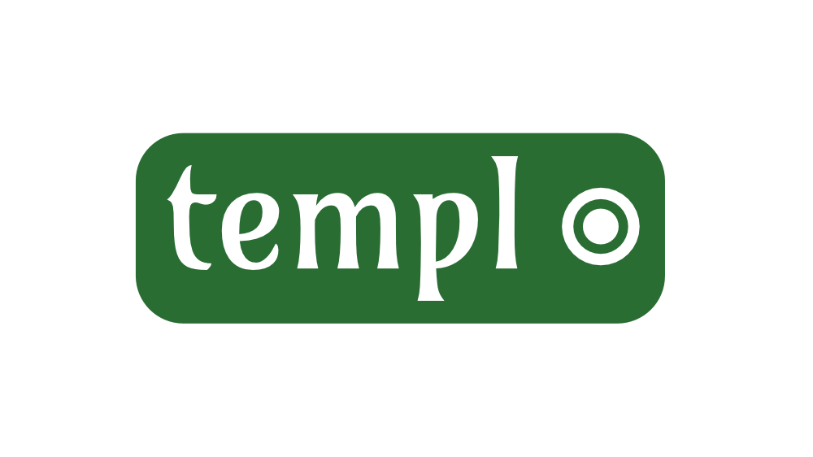

# Jinja2 C++

[](https://github.com/NoobSaibot/templ) [](https://isocpp.org/) [](https://github.com/NoobSaibot/templ/issues) [](https://raw.githubusercontent.com/NoobSaibot/templ/dev/LICENSE) [](https://travis-ci.org/NoobSaibot/templ) [](https://www.codacy.com/manual/NoobSaibot/templ?utm_source=github.com&amp;utm_medium=referral&amp;utm_content=NoobSaibot/templ&amp;utm_campaign=Badge_Grade) [](https://en.wikipedia.org/wiki/Made_in_Germany)



## einfaches beispiel

nachfolgend ist ein einfaches beispiel, indem eine datenstruktur erstellt wird, die in den kontext der
template engine gestellt wird und ein einfaches string template gerendert wird.

```c++
#include "templ.cpp"

int
main(int argc, char **argv) {
    using namespace templ;

    templ_init(MB(100), MB(100), MB(100));

    Templ_Var **vars = 0;
    Templ_Var *name = templ_var("name", val_str("noob"));
    buf_push(vars, name);

    Parsed_Templ *templ = templ_compile_string("hallo {{ name }}");
    char *result = templ_render(templ, vars, buf_len(vars));

    file_write("test.html", result, strlen(result));

    return 0;
}
```

## ausstehende aufgaben

- leerzeichenkontrolle
- filter
- tests
- schleifenrekursion

# umgesetzte aufgaben

## unicode

templ unterstützt sowohl ascii als auch unicode in utf-8 kodierung sowohl für variablen namen, als auch
für die string literale.

```jinja2

{{ シ个 }}

{{ приветствие }}
```

## ausdrücke

nachfolgend ist eine liste der ausdrücke (expressions), die soweit unterstützt werden

### literale

```jinja2
"tolles wetter"
'tolles wetter'
```

zeichenketten werden sowohl mit doppelten, als auch mit einfachen anführungszeichen unterstützt.

```jinja2
42
42.0
```

ganzzahlen und fließkommazahlen werden unterstützt.

```jinja2
['europa', 'asien', 'australien']
```

listen von ausdrücken werden unterstützt. listen können variablen zugewiesen, oder zur 
verwendung in `for` schleifen direkt angegeben werden.

```jinja2
('x', 'y')
```

tupel werden unterstützt. überflüssiges komma nach dem letzten element wird geschluckt.

```jinja2
['name': 'adam', 'alter': '30']
```

dictionaries werden noch nicht in vollem umfang unterstützt.

```jinja2
true
false
```

boolische angaben werden unterstützt.

### mathematische ausdrücke

```jinja2
3+5*7/2
```

folgende mathematische operatoren können verwendet werden.

```jinja2
+
-
*
**
/
//
%
```

## anweisungen

folgende anweisungen werden derzeit unterstützt.

### if

```jinja2

    <anweisungen>

    <anweisungen>

    <anweisungen>

```

als *bedingung* können ausdrücke verwendet werden, die als resultat einen boolischen wert ergeben.

    true
    false
    1 < 2
    a is eq "foo"
    vorname == "arminius" and nachname == "der cherusker"

### for

```jinja2

    <anweisungen>

    <anweisungen>

```

### block

```jinja2


```

### include

```jinja2

```

### import

```jinja2


```

### extends

```jinja2

```

### filter

```jinja2


```

### macro

```jinja2


```

### raw

```jinja2


```
